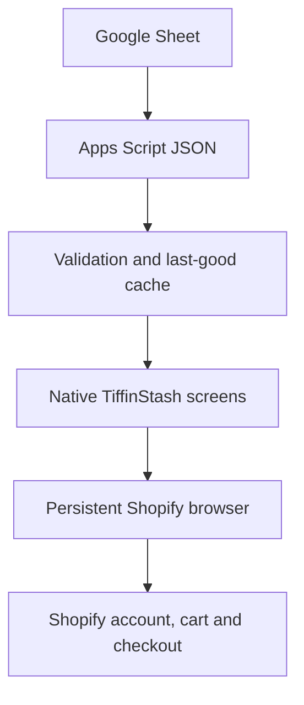

# Architecture and trust boundary

## Content flow

The Sheet controls public presentation data. The app downloads a bounded JSON response over HTTPS, normalizes every field and stores only the last validated copy. A bundled configuration keeps the experience usable before the first successful refresh.

## Native responsibilities

- Home composition, promotional banners, collection cards and featured rails.
- Browse search plus city, diet and saved-item filters.
- Device-local favourites, selected city, dismissed messages and reminder time.
- Optional Monday-to-Friday local notifications. No push token or customer identifier is sent to a server.
- Date-bounded in-app messages and maintenance mode.
- Safe contact handoffs to the user's mail or WhatsApp app.
- Route validation and the in-app browser shell.

## Shopify responsibilities

- Product pages, current prices, variants and availability.
- Globo Product Options fields, including delivery/start-date/add-on logic found in the supplied theme.
- Recurpay subscription plans and customer subscription actions.
- Customer authentication, cart, discounts, taxes, shipping, payment and order creation.

One persistent native WebView keeps Shopify and HTTPS payment redirects in a shared cookie session. The app does not inject JavaScript, inspect the DOM, scrape credentials or use a message bridge. Non-HTTPS schemes are blocked except for user-confirmed contact links. The toolbar shows the current host and warns before opening the system browser because that browser can have a different cart or login.

## Deep links

Production uses the `tiffinstash://` scheme; preview uses `tiffinstash-preview://`. Supported app destinations are `home`, `browse`/`explore`, `plan`, `orders` and `account`. Normal `https://tiffinstash.com/...` links can open in the app's Shopify browser when routed into the app.

Universal Links and Android App Links require domain association files and production signing fingerprints. They are intentionally not claimed as configured in this source package.

## Data stored on the device

- Favourite card IDs.
- Browsing city.
- Local reminder hour/minute and notification schedules.
- IDs of dismissed in-app messages.
- The last good public spreadsheet configuration.
- Shopify's own WebView cookies/cache for the persistent session.

The native layer has no customer database, order feed, payment data, subscription ledger or remote push-token service.

## Release boundary

Content changes can ship through the Sheet after testing. Native code, permissions, SDK changes, app identity, the embedded-browser policy and bundled fallback changes require a new app-store build.
